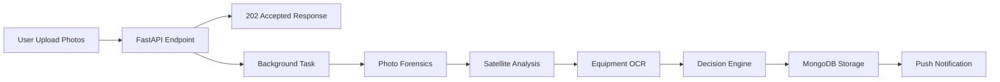

# 💡 Surya Saathi: AI-Powered Solar Subsidy Verification System

<div align="center">

**Slogan:** *Preventing fraud and accelerating India's green energy transition using computer vision and satellite intelligence.*

[](https://fastapi.tiangolo.com/)
[](https://reactnative.dev/)
[](https://www.mongodb.com/)
[](https://www.python.org/)

</div>

---

## 📖 Overview

**Surya Saathi** (Sun Companion) is an AI-driven platform designed to automate and secure the verification process for India's national rooftop solar subsidy program. The system addresses the critical problem of widespread fraud—including fake installations, sub-standard equipment, and tampered photos—that burdens manual verification processes, which currently take 2-3 days.

Our solution provides an **immediate, objective verification score**, enabling swift auto-approval or flagging high-risk applications for manual review.

### 🎯 Problem Statement

The traditional manual verification process is:
- **Slow:** Takes 2-3 days per application
- **Error-prone:** Vulnerable to human oversight
- **Costly:** Wastes time and public funds
- **Scalable:** Cannot handle India's growing solar adoption rate

**Surya Saathi** replaces this with a precise, reproducible, and rapid AI pipeline that detects tampering and validates physical existence and equipment standards.

---

## ✨ Key Features

### 🔍 Fraud Detection
Uses GPS metadata, EXIF data, and shadow analysis to detect location spoofing and photo manipulation.

### 🛰️ Satellite Confirmation
Compares pre- and post-installation satellite imagery using object detection (YOLOv8) to confirm the physical presence of new solar panels.

### ⚙️ Equipment Compliance
Runs OCR (EasyOCR) on close-up photos to extract serial numbers and validates them against the official **ALMM (Approved List of Models and Manufacturers)** database.

### 📊 Performance Benchmarking
Queries the **NREL PVWatts API** to establish the expected energy generation baseline for the verified system.

### 🤖 Automated Decision Engine
Provides an instant confidence score to:
- ✅ Auto-approve legitimate applications
- ❌ Auto-reject fraudulent submissions
- 🔍 Flag suspicious cases for manual review

### ⚡ Asynchronous Processing
Handles intensive AI tasks in the background using FastAPI's `BackgroundTasks`, ensuring immediate API response.

---

## 🏗️ Architecture and Data Flow

The architecture is a **Full-Stack Monorepo** with a decoupled backend processing queue (simulated via BackgroundTasks).

### 🌐 Tech Stack

| Component | Technology | Role |
|:----------|:-----------|:-----|
| **Backend API** | **FastAPI** (Python) | High-performance API serving, routing, and task orchestration |
| **Database** | **MongoDB Atlas** (Motor Driver) | Flexible NoSQL store for user data, application details, and verification reports |
| **Mobile Frontend** | **React Native (Expo)** | Cross-platform mobile app for secure, GPS-tagged photo capture and result viewing |
| **AI/ML Core** | **YOLOv8, EasyOCR, OpenCV, pvlib** | Computer Vision and solar physics processing |
| **Asynchrony** | FastAPI `BackgroundTasks` | Handles non-blocking execution of the slow AI verification pipeline |
| **Storage** | **AWS S3 / Local Storage** | Storage for high-resolution user-uploaded photos |

### 🔗 Simplified Workflow



1. **Submission:** User uploads GPS-tagged photos via the **React Native App**
2. **API Ingestion:** The FastAPI endpoint `/api/v1/applications/submit` saves the files and returns a `202 Accepted` response
3. **Asynchronous Processing:** A `BackgroundTask` runs the entire multi-step verification pipeline (Forensics → Satellite → OCR → Scoring)
4. **Decision:** The system calculates a confidence score (weighted average) and determines the final status (Approved, Rejected, or Manual Review)
5. **Notification:** The final status and detailed report are saved to MongoDB, and an Expo Push Notification is sent to the user

---

## 🔬 AI/ML Verification Pipeline

The core logic of Surya Saathi resides in the `services/` directory.

| Component | Implementation | Confidence Score Weight |
|:----------|:--------------|:----------------------:|
| **Photo Forensics** | `services/photo_forensics.py` | 30% |
| **Satellite Analysis** | `services/satellite_analysis.py` (YOLOv8 + Sentinel Hub) | 30% |
| **Equipment Check** | `services/equipment_check.py` (EasyOCR + ALMM list) | 20% |
| **Shadow Analysis** | `services/photo_forensics.py` (pvlib + OpenCV) | 20% |

The final score is a **weighted average** used by the Decision Engine to determine application status.

---

## 💻 Local Installation and Setup

### Prerequisites

Ensure you have the following installed locally:

- ✅ **Python 3.10+** (Recommended)
- ✅ **Node.js / npm / Expo CLI** (for the frontend)
- ✅ **MongoDB Atlas URI** (The connection string for your database)
- ✅ **API Keys** (Sentinel Hub, NREL PVWatts)
- ⚡ **CUDA Toolkit** (Optional, but highly recommended for GPU acceleration of YOLO/EasyOCR)

### Step 1: Clone the Repository and Set Up Backend

```bash
# 1. Clone the repository
git clone https://github.com/ayushnp/AlgoMinds-SuryaSathi.git
cd AlgoMinds-SuryaSathi/backend

# 2. Create and activate virtual environment
python -m venv venv
source venv/bin/activate  # On Windows: venv\Scripts\activate

# 3. Install Python dependencies
pip install -r requirements.txt

# 4. Create environment file
touch .env  # On Windows: type nul > .env
```

### Step 2: Configure `.env` File

Fill the `backend/.env` file with your credentials (**ensure this file is in your `.gitignore`!**).

```env
# MONGODB ATLAS
MONGO_DB_URI="mongodb+srv://<user>:<password>@<cluster>/surya_saathi_db?..."
MONGO_DB_NAME="surya_saathi_db"

# JWT SECURITY
SECRET_KEY="YOUR_NEW_SECURE_JWT_SECRET"
ACCESS_TOKEN_EXPIRE_MINUTES=1440

# EXTERNAL APIs
SENTINEL_HUB_CLIENT_ID="YOUR_CLIENT_ID"
SENTINEL_HUB_CLIENT_SECRET="YOUR_SECRET"
NREL_PVWATTS_API_KEY="YOUR_NREL_KEY"

# VERIFICATION WEIGHTS
WEIGHT_GPS_MATCH=0.30
WEIGHT_SATELLITE_MATCH=0.30
WEIGHT_EQUIPMENT_CHECK=0.20
WEIGHT_SHADOW_ANALYSIS=0.20
```

### Step 3: Run the Backend Server

Start the FastAPI server from the `backend/` directory.

```bash
uvicorn main:app --reload --port 8000
```

The API should now be running at **http://127.0.0.1:8000**

📚 **Interactive API Documentation:** Visit http://127.0.0.1:8000/docs

### Step 4: Set Up Frontend (React Native)

```bash
# Navigate to frontend directory
cd ../frontend

# Install dependencies
npm install

# Start Expo development server
npx expo start
```

---

## 🖼️ Data Requirement (YOLOv8)

The system requires **pre-trained YOLOv8 weights** (`*.pt` file) for solar panel object detection. 

Upon first run, the system attempts to load the model defined in `services/satellite_analysis.py`. For production accuracy, replace the placeholder weights with your specialized panel detection model.

**Recommended:** Train YOLOv8 on a custom dataset of rooftop solar installations for optimal detection performance.

---

## 📂 Repository Structure

```
surya-saathi/
├── backend/
│   ├── main.py                   # FastAPI app entry point
│   ├── core/                     # Configuration, DB connection, Security
│   │   ├── config.py
│   │   ├── database.py
│   │   └── security.py
│   ├── api/                      # API Endpoints
│   │   ├── auth.py               # Authentication routes
│   │   ├── applications.py       # Application submission
│   │   └── verifications.py      # Verification status
│   ├── models/                   # Pydantic schemas
│   │   ├── user.py
│   │   ├── application.py
│   │   └── report.py
│   ├── services/                 # AI/ML business logic
│   │   ├── photo_forensics.py    # GPS, EXIF, shadow analysis
│   │   ├── satellite_analysis.py # YOLOv8 object detection
│   │   ├── equipment_check.py    # OCR + ALMM validation
│   │   ├── storage.py            # S3/Local file handling
│   │   └── notifications.py      # Expo push notifications
│   ├── requirements.txt
│   └── .env.example
│
└── frontend/
    ├── src/
    │   ├── screens/              # Main UI views
    │   │   ├── CameraScreen.js
    │   │   ├── ReportScreen.js
    │   │   └── HomeScreen.js
    │   ├── services/             # API interaction
    │   │   ├── api.js            # JWT client
    │   │   └── submission.js     # Submission logic
    │   └── components/           # Reusable UI components
    ├── app.json                  # Expo configuration
    ├── package.json
    └── README.md
```

---

## 🚀 API Endpoints

### Authentication

| Method | Endpoint | Description |
|:-------|:---------|:------------|
| POST | `/api/v1/auth/register` | Register new user |
| POST | `/api/v1/auth/login` | Login and receive JWT token |

### Applications

| Method | Endpoint | Description |
|:-------|:---------|:------------|
| POST | `/api/v1/applications/submit` | Submit new solar installation application |
| GET | `/api/v1/applications/{id}` | Get application details |
| GET | `/api/v1/applications/user/{user_id}` | Get all applications for a user |

### Verifications

| Method | Endpoint | Description |
|:-------|:---------|:------------|
| GET | `/api/v1/verifications/{application_id}` | Get verification report |
| GET | `/api/v1/verifications/status/{application_id}` | Get verification status |

---

## 🧪 Testing

```bash
# Run backend tests
cd backend
pytest tests/

# Run frontend tests
cd frontend
npm test
```

---

## 🤝 Contributing

We welcome contributions! Please follow these steps:

1. Fork the repository
2. Create a feature branch (`git checkout -b feature/amazing-feature`)
3. Commit your changes (`git commit -m 'Add amazing feature'`)
4. Push to the branch (`git push origin feature/amazing-feature`)
5. Open a Pull Request

---

## 📝 License

This project is licensed under the MIT License - see the [LICENSE](LICENSE) file for details.

---

## 👥 Team

**AlgoMinds**

- Project Lead: [Your Name]
- ML Engineer: [Name]
- Backend Developer: [Name]
- Frontend Developer: [Name]

---

## 🙏 Acknowledgments

- **NREL PVWatts API** for solar performance data
- **Sentinel Hub** for satellite imagery
- **YOLOv8** by Ultralytics
- **EasyOCR** for text extraction
- India's Ministry of New and Renewable Energy (MNRE) for subsidy program details

---

## 📧 Contact

For questions or support, please reach out to:
- Email: support@suryasaathi.in
- GitHub Issues: [Create an issue](https://github.com/ayushnp/AlgoMinds-SuryaSathi/issues)

---

<div align="center">

**Made with ❤️ for a greener India**

⭐ Star this repo if you find it useful!

</div>
